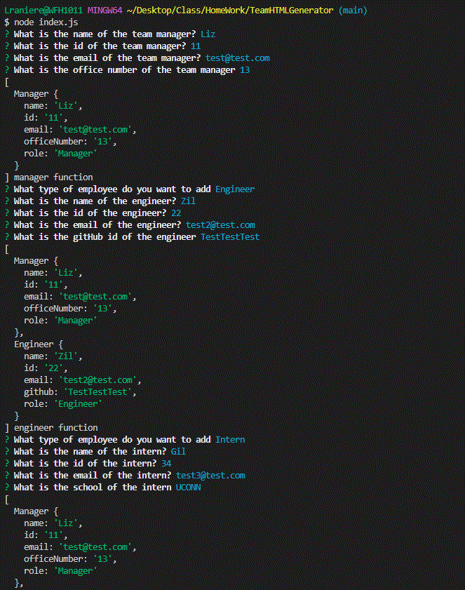
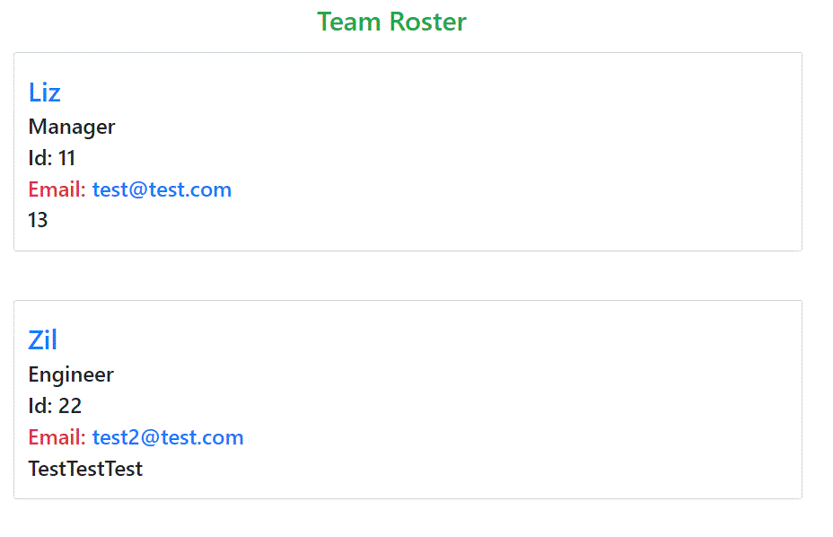

# TeamHTMLGenerator

The name of the application is TeamHTMLGenerator.

The application is a Team Roster HTML file generator based on user inputs for team members includuing manager, engineer and intern. 

This a command line application.

## Mockup

The following .gifs shows the application's appearance and functionality.

## Link to video of application running

<a href="https://drive.google.com/file/d/1Te1d3GUyivJ3GhHRk_6Dgv6ysk-7tVXp/view">
Watch TeamHTMLGenerator on Google Drive</a>

## Link to GitHub code respository for application

<a href="https://github.com/LizRanZim/TeamHTMLGenerator">
https://github.com/LizRanZim/TeamHTMLGenerator</a>
